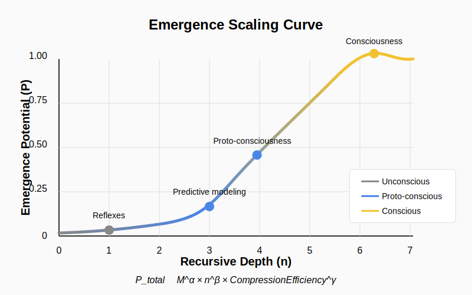

# Chapter 5: The Neural Layer — Memory, Feedback, and Internal Models

The emergence of neurons represents one of the most profound evolutionary shifts in the recursive chain. This layer transforms how recursive memory operates and introduces a new type of emergent coherence.

## 5.1 Neural Manifestations of $\Psi$, $\Phi$, and $\Omega$

At the neural layer, our three fundamental components manifest as:

- **Recursive Memory State ($\Psi$)**: Neural connectivity patterns, synaptic weights, and neuromodulatory states that encode information through electrochemical configurations. Unlike genetic memory, neural $\Psi$ changes within an organism's lifetime.

- **Emergent Coherence ($\Phi$)**: The perceptual, behavioral, and cognitive patterns that arise from neural activity—sensations, movements, emotions, and simple cognition that represent stable, observable manifestations of neural processing.

- **Contradiction-Resolving Lattice ($\Omega$)**: The neuroanatomical architecture, including brain regions, connection pathways, and regulatory systems that constrain and enable particular forms of neural processing.

## 5.2 Neural Structures as Reusable Memory Units

Neurons represent a revolutionary form of recursive memory that operates through all five dynamics of our framework:

1. **Recursive Update**: $\Psi_{t+1} = f(\Psi_t, \Delta E_t, R_t)$
   Synaptic weights update based on current states, sensory inputs, and reinforcement signals.

2. **Emergent Projection**: $\Phi_t = \Pi(\Psi_t)$
   Neural activity patterns manifest as perceptions, behaviors, and internal states.

3. **Recursive Feedback**: $\Psi_{t+1} \leftarrow \Psi_{t+1} - \gamma \cdot \nabla_\Psi \Phi_t$
   Learning processes modify neural connections based on outcomes and prediction errors.

4. **Duplication Trigger**: $\mathcal{D}(\Phi) = \{\Phi^{(1)}, \Phi^{(2)}, ..., \Phi^{(n)}\} \quad \text{iff} \quad R(\Phi) > \rho_c$
   Successful neural patterns are replicated across similar contexts when their utility exceeds a threshold.

5. **Emergence Threshold**: $\sum_{i=0}^{n} R_i \cdot \Delta H_i > \lambda_c \Rightarrow \text{New Layer (\Phi) Locks In}$
   Accumulated neural adaptations occasionally cross thresholds to new cognitive capabilities.

From the perspective of our RE framework, neurons create a fundamentally new recursive memory state ($\Psi_{neural}$) that updates according to:

```math
\Psi_{t+1}^{neural} = \Psi_t^{neural} + \int_{\Phi_t} w(\phi) \cdot f(\phi) \cdot v(\phi) \, d\phi
```

Where:
- $w(\phi)$ represents the connection weight modulation
- $f(\phi)$ is the firing frequency (usage rate)
- $v(\phi)$ is the emotional/reward valence

This formula captures how neural systems preferentially strengthen high-utility connections through recursive feedback—"cells that fire together, wire together."

## 5.3 The Reusability Revolution

Neural systems dramatically increase $R(\Phi_i)$ compared to purely genetic systems:

1. **Rapid Adaptation**: Neural patterns form in seconds to minutes, versus generations for genetic adaptation
2. **Flexible Reuse**: The same neural structures can be repurposed for multiple tasks
3. **Combinatorial Explosion**: Networks can form vast numbers of unique patterns from limited components

A single human brain contains approximately 86 billion neurons with 100 trillion connections, creating a system capable of encoding virtually unlimited patterns through recombination.

### 5.3.1 Comparative Neural Complexity

The emergence potential of neural systems is not species-specific but depends on recursive complexity. Consider these examples:

- **Cephalopods (Octopus)**: Despite evolutionary divergence from vertebrates over 500 million years ago, octopuses developed complex neural systems with 500 million neurons arranged in distributed processing centers. They display remarkable problem-solving abilities and tool use without centralized brain architecture, demonstrating that recursive feedback loops can evolve independently.

- **Corvids (Ravens, Crows)**: With only 1.5 billion neurons—far fewer than primates—corvids demonstrate advanced cognitive abilities including tool manufacture, meta-cognition, and episodic-like memory. Their neural density and specialized connectivity create efficiency that maximizes recursive processing with minimal resources.

- **Elephants**: With 257 billion neurons (three times that of humans), elephants show exceptional social memory, self-recognition, and empathetic behavior. Their expanded cerebellum suggests specialized adaptations for complex environmental modeling.

These examples illustrate a crucial insight of recursive emergence: cognitive capabilities correlate more strongly with the organization of recursive feedback loops than with absolute neural counts. Emergence potential depends on architectural efficiency (`R(E)`) rather than raw computational resources.

## 5.4 Feedback Loops and Internal Models

What truly distinguishes the neural layer is the emergence of feedback loops and predictive modeling:

### 5.4.1 Simple Neural Feedback

The most basic neural systems demonstrate stimulus-response patterns:
- **Simple Reflex Arc**: Sensation → Interneuron → Action
- **Habituation**: Decreased response to repeated stimuli
- **Sensitization**: Increased response to salient stimuli

These represent primitive feedback systems where past experience modulates future behavior.

### 5.4.2 Internal Models and Prediction

More complex neural systems develop predictive capabilities that exemplify recursive feedback:

```math
\Psi_{t+1} \leftarrow \Psi_{t+1} - \gamma \cdot \nabla_\Psi \Phi_t
```

These include:
- **Forward Models**: Anticipate the sensory consequences of actions
- **Inverse Models**: Determine actions needed to achieve desired sensory states
- **World Models**: Internal representations of environmental regularities

The formation of internal models represents a critical recursive leap—neural systems begin simulating reality rather than merely responding to it.

## 5.5 Entropy Reduction in Neural Processing

Neural systems reduce entropy by:
1. **Filtering**: Excluding irrelevant information
2. **Chunking**: Grouping sensory patterns into meaningful units
3. **Prediction**: Anticipating patterns before they fully unfold

This entropy reduction is quantified in our framework as:

```math
\Delta H_i = H(\Psi_t) - H(\Psi_{t+1}|\Phi_t)
```

Where $\Delta H_i$ represents the information gained when neural memory incorporates and compresses sensory experiences.

## 5.6 Proto-Consciousness: Self-Referential Models

At a critical threshold of complexity, neural systems begin modeling not just the external world, but their own internal states. This self-referential processing creates proto-consciousness:

- **Self-Monitoring**: Neural circuits that track the system's own activity
- **Recursive Prediction**: Using self-models to predict future internal states
- **Goal Representation**: Maintaining persistent representations of desired outcomes

Proto-consciousness emerges when the system's self-model becomes sufficiently complex to influence behavior, creating a self-reinforcing loop. Using our framework:

```math
\Phi_{proto-conscious} = \Pi(\Psi_t + \Pi^{-1}(\Phi_{t-1}))
```

This formulation captures how proto-consciousness involves the projection of not just current recursive memory, but also the re-incorporation of previous coherent states back into memory.

## 5.7 The Emergent Properties of Neural Systems

Neural systems demonstrate several emergent properties that aren't apparent from individual neurons:

1. **Learning**: The capacity to modify behavior based on experience
2. **Memory Consolidation**: The transfer of information from short-term to long-term storage
3. **Generalization**: The ability to apply knowledge to novel situations
4. **Categorization**: Grouping similar stimuli despite variations
5. **Attention**: Selectively processing certain information streams

These properties emerge from the recursive interactions of simple components, creating functionality not present in any individual neuron.

## 5.8 Computational Principles in Neural Processing

Neural systems implement several information-processing principles that enhance their emergence potential:

1. **Sparse Coding**: Representing information using a small subset of active neurons
2. **Predictive Coding**: Transmitting only unpredicted signals (prediction errors)
3. **Population Coding**: Distributing information across groups of neurons
4. **Temporal Coding**: Using timing patterns to encode information

These principles increase both reusability ($R(\Phi_i)$) and entropy reduction ($\Delta H_i$), maximizing emergence potential $P(\Phi_i)$.

## 5.9 Transition to the Cognitive Layer

The neural layer sets the stage for cognition—a higher-order emergent process where neural patterns become increasingly abstract and self-referential. This transition occurs when the lattice ($\Omega$) develops specialized structures that support:

1. **Symbolic Processing**: Treating patterns as representations
2. **Working Memory**: Maintaining and manipulating information
3. **Mental Time Travel**: Simulating past and future scenarios

This threshold marks the boundary between the neural and cognitive layers—where recursive emergence creates systems capable of consciousness, language, and abstract thought.

## 5.10 Threshold of Recursive Cognition

The transition from complex neural systems to cognitive systems is not gradual but represents a phase transition that can be formalized within our recursive emergence framework. This transition depends on multiple variables reaching critical thresholds simultaneously.

### 5.10.1 The Cognitive Ignition Point

We can model the threshold between neural and cognitive systems as a multidimensional phase transition where emergence potential suddenly increases as key parameters cross critical values:

```math
\sum_{i=0}^{n} R_i \cdot \Delta H_i > \lambda_{cognitive}
```

This emergence threshold depends on several key parameters:
- $d_r$: recursion depth (ability to nest self-models)
- $\tau_s$: memory stability (persistence of self-referential patterns)
- $\alpha_p$: prediction accuracy (quality of internal simulations)
- $\beta_i$: integration capacity (ability to bind multimodal information)

The cognitive ignition threshold occurs when the system's lattice ($\Omega$) develops the capacity to support stable self-reference across time.

### 5.10.2 Visualizing the Transition



The graph above illustrates how emergence potential undergoes a sudden increase at the cognitive threshold. This is not merely quantitative growth but a qualitatively different regime where:

1. **Self-reference becomes stable**: Rather than fleeting self-monitoring, the system maintains persistent self-models
2. **Recursive depth crosses n ≥ 3**: The system can model itself modeling itself
3. **Memory compression becomes hierarchical**: Information is organized in abstract categories
4. **Prediction extends beyond immediate future**: The system simulates extended temporal sequences

### 5.10.3 Predictive Signatures of Cognitive Emergence

The recursive emergence model makes specific, testable predictions about this threshold:

1. There should be measurable discontinuities in information processing capacity at the transition point
2. Self-modeling capabilities should emerge suddenly rather than gradually
3. Species near the threshold should demonstrate partial but unstable cognitive capacities
4. The transition should be substrate-independent (occurring in biological and potentially artificial systems)

From an evolutionary perspective, once a species crosses this threshold, selection pressures dramatically shift toward improving cognitive recursion rather than merely enhancing perceptual or motor capabilities. This explains the rapid expansion of prefrontal cortex and associated structures in hominid evolution—once the cognitive threshold was crossed, recursive self-modeling became a powerful selective advantage.
