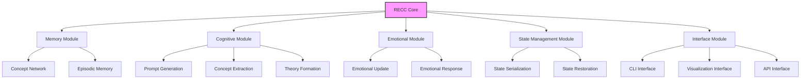

# RECC MVP 1.5: Interactive Visualization & Observability

## 1. 📋 Overview

MVP 1.5 marks a significant advancement in the RECC project's observability and interactive capabilities. Building on the emotional primitives and state management introduced in MVP 1.4, this milestone focuses on creating a robust visualization system that enables real-time monitoring and interaction with RECC's cognitive processes.

This milestone is inspired by the successful visualization approach used in our lab/life_origins/simulation module, which provides real-time insights into complex emergence processes. By adapting this architecture to RECC, we aim to make the agent's "thinking" transparent and interactive.

## 2. 🧠 Theoretical Foundation: Observable Cognition

### 2.1 Transparency of Emergent Systems

The ability to observe and interact with emergent systems is critical for understanding their properties. In our Recursive Emergence framework, observability provides three key benefits:

1. **Validation**: Confirms that expected emergent properties are actually arising
2. **Debugging**: Allows detection of pathological patterns (loops, stagnation)
3. **Interaction**: Enables steering of emergence rather than mere observation

This theoretical approach connects to our thesis Chapter 7 (Collective Intelligence) and Chapter 8 (Measurement), where we discuss how observability is a prerequisite for meaningful intervention in complex systems.

### 2.2 The Observer-Participant Effect

In emergent cognitive systems, the act of observation itself shapes development through:

```math
S_{t+1} = f(S_t, I_t, O_t)
```

Where:
- `S_t` is system state at time `t`
- `I_t` is intrinsic development processes
- `O_t` is observer interaction

This feedback loop, where human observation and interaction become part of the system's developmental inputs, creates a richer path for emergence beyond what either autonomous development or human design could accomplish alone.

## 3. 🔄 Modular Architecture Approach

Moving forward, RECC will adopt a more modular architecture to support scalability, maintainability, and team collaboration. This approach will divide the system into distinct modules with well-defined interfaces.

### 3.1 Core Module Structure



### 3.2 Module Interface Design

Each module will expose a clear public interface while encapsulating implementation details:

```python
class MemoryModule:
    def __init__(self):
        self._concept_network = ConceptNetwork()  # Internal implementation
        self._entries = []                        # Internal implementation
    
    # Public interface
    def add(self, prompt, response, state):
        """Add a memory entry and process concepts"""
        # Implementation details hidden
        
    def get_recent(self, n=5):
        """Get recent memory entries"""
        # Implementation details hidden
        
    def get_core_concepts(self, n=5):
        """Get core concepts from memory"""
        # Implementation details hidden
```

### 3.3 Event-Driven Communication

Modules will communicate via an event system rather than direct method calls:

```python
class EventBus:
    def __init__(self):
        self.subscribers = {}
        
    def subscribe(self, event_type, callback):
        if event_type not in self.subscribers:
            self.subscribers[event_type] = []
        self.subscribers[event_type].append(callback)
        
    def publish(self, event_type, data):
        if event_type in self.subscribers:
            for callback in self.subscribers[event_type]:
                callback(data)
```

This will enable:
1. **Loose coupling** - Modules can evolve independently 
2. **Extensibility** - New modules can subscribe to existing events
3. **Testability** - Modules can be tested in isolation with mock events
4. **Observability** - The visualization server can subscribe to all relevant events

### 3.4 Benefits for MVP 1.5

This modular approach specifically benefits the interactive visualization goals of MVP 1.5 by:

1. Allowing the visualization server to operate as a separate process
2. Enabling real-time updates without blocking the main cognitive loop
3. Providing clean access points for metric collection
4. Supporting multiple simultaneous observers/interfaces

## 4. 🌐 Implementation Plan: Interactive Visualization Server

### 4.1 Server Architecture

```python
class RECCVisualizationServer:
    def __init__(self, port=5000):
        self.app = Flask(__name__, 
                         static_folder='visualization/static',
                         template_folder='visualization/templates')
        self.socketio = SocketIO(self.app, cors_allowed_origins="*")
        self.port = port
        self.recc_instance = None
        self.simulation_thread = None
        self.simulation_running = False
        self.stop_simulation = False
        
        # Register routes and socket events
        self._register_routes()
        self._register_socket_events()
        
        # Ensure visualization directories exist
        os.makedirs("visualization/templates", exist_ok=True)
        os.makedirs("visualization/static", exist_ok=True)
    
    def _register_routes(self):
        # Main visualization dashboard
        @self.app.route('/')
        def index():
            return render_template('index.html')
        
        # Static file serving
        @self.app.route('/static/<path:path>')
        def serve_static(path):
            return send_from_directory('visualization/static', path)
    
    def _register_socket_events(self):
        # Handle client connection
        @self.socketio.on('connect')
        def handle_connect():
            print('Client connected')
            self.socketio.emit('status', {'status': 'Connected to visualization server'})
        
        # Handle starting RECC simulation
        @self.socketio.on('start_simulation')
        def handle_start_simulation(data):
            if self.simulation_running:
                self.socketio.emit('status', {'status': 'Simulation already running'})
                return
                
            # Reset stop flag
            self.stop_simulation = False
            
            # Get parameters
            steps = data.get('steps', 20)
            mode = data.get('mode', 'autonomous')
            
            # Start simulation in a separate thread
            self.simulation_thread = threading.Thread(
                target=self._run_recc_simulation,
                args=(steps, mode)
            )
            self.simulation_running = True
            self.simulation_thread.start()
            
            self.socketio.emit('status', {'status': 'RECC simulation started'})
        
        # Handle stopping simulation
        @self.socketio.on('stop_simulation')
        def handle_stop_simulation():
            self.stop_simulation = True
            self.socketio.emit('status', {'status': 'Stopping RECC simulation...'})
        
        # Handle direct prompt interaction
        @self.socketio.on('send_prompt')
        def handle_send_prompt(data):
            if not self.recc_instance:
                self.socketio.emit('error', {'message': 'RECC not initialized'})
                return
                
            prompt = data.get('prompt', '')
            if not prompt:
                self.socketio.emit('error', {'message': 'Empty prompt'})
                return
                
            # Process prompt in a non-blocking way
            threading.Thread(target=self._process_prompt, args=(prompt,)).start()
            
    def _run_recc_simulation(self, steps, mode):
        """Run the RECC simulation with real-time updates"""
        try:
            # Initialize RECC if not already done
            if not self.recc_instance:
                self.recc_instance = RECC(openai_llm)
                
            # Override the standard autonomous loop for visualization
            for step in range(steps):
                if self.stop_simulation:
                    break
                    
                # Generate prompt based on mode
                if mode == 'autonomous':
                    prompt = self.recc_instance.generate_prompt()
                    self.socketio.emit('prompt_generated', {'prompt': prompt})
                else:
                    # In interactive mode, wait for client to send prompt
                    self.socketio.emit('waiting_for_prompt', {'step': step})
                    # The handle_send_prompt will handle processing
                    continue
                
                # Process the prompt (reusing the same method)
                self._process_prompt(prompt)
                
                # Small pause between steps
                time.sleep(1)
                
        except Exception as e:
            self.socketio.emit('error', {'message': str(e)})
            
        finally:
            self.simulation_running = False
            self.socketio.emit('status', {'status': 'Simulation complete'})
            
    def _process_prompt(self, prompt):
        """Process a single prompt and emit updates"""
        try:
            # Get response from LLM
            response = self.recc_instance.llm(prompt)
            
            # Add to memory and get entry
            entry = self.recc_instance.memory.add(prompt, response, self.recc_instance.state.copy())
            
            # Reflect and get decision
            decision = self.recc_instance.me.reflect()
            
            # Extract metrics and visualization data
            metrics = self._extract_metrics()
            concept_network = self._extract_concept_network()
            emotional_state = self.recc_instance.me.emotional_state
            
            # Check for thresholds crossing (like repetition detection)
            thresholds = self._check_thresholds()
            
            # Send comprehensive update to client
            update_data = {
                'prompt': prompt,
                'response': response,
                'cycle': len(self.recc_instance.memory.entries),
                'metrics': metrics,
                'concept_network': concept_network,
                'emotional_state': emotional_state,
                'decision': decision,
                'thresholds': thresholds
            }
            
            self.socketio.emit('recc_update', update_data)
            
            # Save visualization artifacts
            self._save_visualizations()
            
        except Exception as e:
            self.socketio.emit('error', {'message': str(e)})
    
    def _extract_metrics(self):
        """Extract key metrics from RECC for visualization"""
        memory = self.recc_instance.memory
        me = self.recc_instance.me
        
        # Calculate novelty and reuse metrics
        novelty_gradient, reuse_gradient = memory.compute_gradients()
        recent = memory.get_recent(5)
        avg_novelty = sum(e.get('novelty', 0) for e in recent) / max(len(recent), 1)
        
        # Network statistics
        network_stats = memory.concept_network.get_network_stats()
        
        return {
            'memory_size': len(memory.entries),
            'concept_count': network_stats['concept_count'],
            'relation_count': network_stats['relation_count'],
            'avg_connections': network_stats['avg_connections'],
            'network_density': network_stats['density'],
            'novelty_gradient': novelty_gradient,
            'reuse_gradient': reuse_gradient,
            'avg_novelty': avg_novelty,
            'theory_count': len(me.personal_theories)
        }
        
    def _extract_concept_network(self):
        """Extract concept network data for visualization"""
        network = self.recc_instance.memory.concept_network
        
        # Extract nodes (concepts)
        nodes = []
        for concept_id, concept in network.concepts.items():
            nodes.append({
                'id': concept_id,
                'name': concept['name'],
                'activation': concept.get('activation', 0.5),
                'reuse_count': concept.get('reuse_count', 0),
                'created': concept.get('created', '')
            })
            
        # Extract edges (relations)
        edges = []
        for relation in network.relations:
            edges.append({
                'id': relation.get('id', ''),
                'source': relation.get('source', ''),
                'target': relation.get('target', ''),
                'type': relation.get('type', 'association'),
                'weight': relation.get('weight', 0.5)
            })
            
        return {
            'nodes': nodes,
            'edges': edges
        }
        
    def _check_thresholds(self):
        """Check for threshold events in RECC"""
        thresholds_crossed = []
        
        # Check for repetition
        if self.recc_instance.memory.detect_repetition():
            thresholds_crossed.append({
                'type': 'repetition',
                'description': 'Repetition pattern detected',
                'severity': 'high'
            })
            
        # Check for emotional threshold crossings
        emotions = self.recc_instance.me.emotional_state
        if emotions.get('frustration', 0) > 0.8:
            thresholds_crossed.append({
                'type': 'emotional',
                'emotion': 'frustration',
                'description': 'High frustration detected',
                'severity': 'medium'
            })
            
        if emotions.get('curiosity', 0) > 0.8:
            thresholds_crossed.append({
                'type': 'emotional',
                'emotion': 'curiosity',
                'description': 'High curiosity detected',
                'severity': 'low'
            })
            
        return thresholds_crossed
        
    def _save_visualizations(self):
        """Save visualization artifacts (images) for the current state"""
        timestamp = datetime.now().strftime("%Y%m%d_%H%M%S")
        
        # Save concept map
        concept_map_path = f"visualization/static/concept_map_{timestamp}.png"
        draw_concept_map(
            concept_network=self.recc_instance.memory.concept_network,
            save_path=concept_map_path
        )
        
        # Save emotional state visualization (if enough history)
        if len(self.recc_instance.me.emotion_history) > 2:
            emotion_path = f"visualization/static/emotions_{timestamp}.png"
            visualize_emotions(
                self.recc_instance.me,
                save_path=emotion_path
            )
            
        return {
            'concept_map': concept_map_path,
            'emotions': emotion_path if len(self.recc_instance.me.emotion_history) > 2 else None
        }
    
    def run(self):
        """Run the visualization server"""
        print(f"Starting RECC visualization server at http://localhost:{self.port}")
        self.socketio.run(self.app, host='0.0.0.0', port=self.port, debug=True, allow_unsafe_werkzeug=True)
```

### 4.2 Web Interface Components

The web interface will include the following visualization components:

1. **Concept Network Visualization**: Interactive force-directed graph showing RECC's cognitive network
2. **Emotional State Monitor**: Real-time gauges and time-series charts showing emotional state
3. **Interaction Console**: Direct input/output interface for sending prompts to RECC
4. **Development Timeline**: Visual history of RECC's developmental stages and breakthrough moments
5. **Metrics Dashboard**: Real-time analytics on concept formation rate, novelty, and complexity

### 4.3 Interactive Features

Unlike previous MVPs that only offered post-hoc analysis, MVP 1.5 enables:

```python
def add_interactive_features():
    return {
        'steered_prompts': "User can directly input prompts to guide development",
        'threshold_alerts': "System notifies about significant cognitive events",
        'state_inspection': "Interactive exploration of current cognitive state",
        'development_intervention': "Ability to modify parameters during runtime",
        'concept_injection': "Add new concepts to seed cognitive development"
    }
```

## 5. 🖥️ Front-end Implementation

### 5.1 Dashboard Layout

```html
<!-- Main dashboard layout with responsive design -->
<div class="dashboard-container">
  <div class="row">
    <div class="col-8">
      <div class="panel" id="conceptNetworkPanel">
        <!-- D3.js force-directed graph for concept network -->
      </div>
    </div>
    <div class="col-4">
      <div class="panel" id="emotionalStatePanel">
        <!-- Emotion gauges and sparkline charts -->
      </div>
      <div class="panel" id="metricsPanel">
        <!-- Key metrics display -->
      </div>
    </div>
  </div>
  <div class="row">
    <div class="col-8">
      <div class="panel" id="interactionPanel">
        <!-- Prompt input, response display, history log -->
      </div>
    </div>
    <div class="col-4">
      <div class="panel" id="thresholdPanel">
        <!-- Threshold event notifications -->
      </div>
      <div class="panel" id="controlPanel">
        <!-- Control buttons, parameter adjustments -->
      </div>
    </div>
  </div>
</div>
```

### 5.2 Real-time Data Visualization

```javascript
// Sample D3.js code for real-time concept network visualization
function updateConceptNetwork(data) {
  const nodes = data.concept_network.nodes;
  const links = data.concept_network.edges;
  
  // Create a force simulation
  const simulation = d3.forceSimulation(nodes)
      .force("link", d3.forceLink(links).id(d => d.id))
      .force("charge", d3.forceManyBody().strength(-300))
      .force("center", d3.forceCenter(width / 2, height / 2));
      
  // Create the links
  const link = svg.append("g")
      .selectAll("line")
      .data(links)
      .join("line")
      .attr("stroke-width", d => Math.sqrt(d.weight * 3))
      .attr("stroke", "#999")
      .attr("stroke-opacity", 0.6);
      
  // Create the nodes
  const node = svg.append("g")
      .selectAll("circle")
      .data(nodes)
      .join("circle")
      .attr("r", d => 5 + d.reuse_count * 2)
      .attr("fill", d => colorScale(d.activation))
      .call(drag(simulation));
      
  // Add labels to the nodes
  const label = svg.append("g")
      .selectAll("text")
      .data(nodes)
      .join("text")
      .text(d => d.name)
      .attr("font-size", 12)
      .attr("dx", 12)
      .attr("dy", ".35em");
      
  // Update position on simulation tick
  simulation.on("tick", () => {
    link
        .attr("x1", d => d.source.x)
        .attr("y1", d => d.source.y)
        .attr("x2", d => d.target.x)
        .attr("y2", d => d.target.y);
    
    node
        .attr("cx", d => d.x)
        .attr("cy", d => d.y);
        
    label
        .attr("x", d => d.x)
        .attr("y", d => d.y);
  });
}

// Emotion visualization with gauges
function updateEmotionGauges(emotions) {
  Object.entries(emotions).forEach(([emotion, value]) => {
    const gauge = gauges[emotion];
    gauge.set(value * 100); // Convert 0-1 to percentage
    
    // Update color based on value
    const color = value > 0.7 ? "#ff0000" : 
                  value > 0.4 ? "#ffaa00" : "#00aa00";
    gauge.setOptions({ colorStart: color });
  });
}
```

### 5.3 WebSocket Event Handling

```javascript
// Handle WebSocket events for real-time updates
const socket = io();

// Connection status
socket.on('connect', () => {
  console.log('Connected to server');
  showStatus('Connected');
});

// Receive RECC updates
socket.on('recc_update', (data) => {
  // Update interface with new data
  updateConceptNetwork(data.concept_network);
  updateEmotionGauges(data.emotional_state);
  updateMetrics(data.metrics);
  appendInteraction(data.prompt, data.response);
  
  // Check for threshold events
  if (data.thresholds && data.thresholds.length > 0) {
    showThresholdAlerts(data.thresholds);
  }
});

// Handle threshold detection
socket.on('threshold_detection', (data) => {
  const { thresholds, step } = data;
  
  thresholds.forEach(threshold => {
    const alertElement = document.createElement('div');
    alertElement.classList.add('threshold-alert', threshold);
    alertElement.innerHTML = `<strong>Threshold crossed at step ${step}:</strong> ${threshold}`;
    document.getElementById('thresholdPanel').appendChild(alertElement);
    
    // Highlight related elements in the visualization
    highlightRelatedNodes(threshold);
  });
});

// Start the simulation
function startSimulation(mode = 'autonomous') {
  socket.emit('start_simulation', {
    steps: parseInt(document.getElementById('steps').value) || 20,
    mode: mode
  });
}

// Send a prompt from the UI
function sendPrompt() {
  const promptInput = document.getElementById('promptInput');
  const prompt = promptInput.value.trim();
  
  if (prompt) {
    socket.emit('send_prompt', { prompt });
    promptInput.value = '';
  }
}
```

## 6. 🔄 Integration of Observability into RECC Core

### 6.1 Enhanced RECC Class

```python
class RECC:
    def __init__(self, llm_function):
        # Existing initialization...
        
        # Event handlers for observability
        self.on_cycle_complete = []
        self.on_concept_created = []
        self.on_emotional_change = []
        self.on_threshold_crossed = []
        
        # Observable metrics
        self.metrics = {
            'cycle_times': [],            # Time per cycle
            'prompt_complexity': [],      # Complexity trend of prompts
            'response_novelty': [],       # Novelty scores of responses
            'concept_creation_rate': []   # Concepts created per cycle
        }
        
    def register_handler(self, event_type, handler_function):
        """Register event handlers for observability"""
        if event_type == 'cycle_complete':
            self.on_cycle_complete.append(handler_function)
        elif event_type == 'concept_created':
            self.on_concept_created.append(handler_function)
        elif event_type == 'emotional_change':
            self.on_emotional_change.append(handler_function)
        elif event_type == 'threshold_crossed':
            self.on_threshold_crossed.append(handler_function)
        
    def emit_event(self, event_type, data):
        """Emit an event to all registered handlers"""
        if event_type == 'cycle_complete':
            for handler in self.on_cycle_complete:
                handler(data)
        elif event_type == 'concept_created':
            for handler in self.on_concept_created:
                handler(data)
        elif event_type == 'emotional_change':
            for handler in self.on_emotional_change:
                handler(data)
        elif event_type == 'threshold_crossed':
            for handler in self.on_threshold_crossed:
                handler(data)
                
    def autonomous_loop(self, steps=5, delay=3, save_interval=10):
        """Enhanced autonomous loop with observability events"""
        # Existing implementation...
        
        for step in range(steps):
            cycle_start_time = time.time()
            
            # Generate prompt
            prompt = self.generate_prompt()
            
            # Use the LLM to get a response
            if step == 0 and self.reset_conversation_history:
                response = self.llm(prompt, reset_history=True)
                self.reset_conversation_history = False
            else:
                response = self.llm(prompt, reset_history=False)
            
            # Process the interaction and get metrics
            entry = self.memory.add(prompt, response, self.state.copy())
            decision = self.me.reflect()
            
            # Calculate cycle metrics
            cycle_time = time.time() - cycle_start_time
            
            # Track metrics
            self.metrics['cycle_times'].append(cycle_time)
            
            # Count new concepts
            new_concepts = entry.get('concept_data', {}).get('new_concepts', 0)
            self.metrics['concept_creation_rate'].append(new_concepts)
            
            # Track prompt complexity
            prompt_complexity = len(prompt.split())
            self.metrics['prompt_complexity'].append(prompt_complexity)
            
            # Track novelty
            self.metrics['response_novelty'].append(entry.get('novelty', 0))

            # Emit the cycle complete event
            self.emit_event('cycle_complete', {
                'step': step,
                'total_steps': steps,
                'prompt': prompt,
                'response': response,
                'cycle_time': cycle_time,
                'decision': decision,
                'entry': entry,
                'metrics': {
                    'new_concepts': new_concepts,
                    'prompt_complexity': prompt_complexity,
                    'novelty': entry.get('novelty', 0),
                    'emotional_state': self.me.emotional_state
                }
            })
            
            # Emit threshold events for significant changes
            self._check_and_emit_thresholds()
            
            # Rest of implementation...
            
        return self.memory.symbols, self.memory.symbol_links
        
    def _check_and_emit_thresholds(self):
        """Check for threshold crossings and emit events"""
        # Check for repetition
        if self.memory.detect_repetition():
            self.emit_event('threshold_crossed', {
                'threshold_type': 'repetition',
                'description': 'Repetition pattern detected',
                'cycle': len(self.memory.entries),
                'severity': 'high'
            })
            
        # Check for emotional threshold crossings
        emotions = self.me.emotional_state
        prev_emotions = self.me.emotion_history[-2]['state'] if len(self.me.emotion_history) > 1 else emotions
        
        for emotion, value in emotions.items():
            prev_value = prev_emotions.get(emotion, 0.5)
            
            # Detect significant emotional changes
            if abs(value - prev_value) > 0.25:  # Major shift
                self.emit_event('emotional_change', {
                    'emotion': emotion,
                    'previous': prev_value,
                    'current': value,
                    'delta': value - prev_value,
                    'cycle': len(self.memory.entries)
                })
```

### 6.2 Observable Memory

```python
class Memory:
    # Add this to the existing Memory class...
    
    def get_observability_data(self):
        """Get a comprehensive dataset for observability"""
        # Get concept network statistics
        network_stats = self.concept_network.get_network_stats()
        
        # Get centrality metrics
        centrality = {}
        if hasattr(self.concept_network, 'graph') and len(self.concept_network.graph) > 0:
            try:
                centrality = {
                    'degree': nx.degree_centrality(self.concept_network.graph),
                    'betweenness': nx.betweenness_centrality(self.concept_network.graph),
                    'pagerank': nx.pagerank(self.concept_network.graph)
                }
            except:
                pass
        
        # Extract recent memory trend metrics
        recent = self.get_recent(10)
        novelty_trend = [e.get('novelty', 0) for e in recent]
        reuse_trend = [e.get('reuse_score', 0) for e in recent]
        
        # Compute memory efficiency metrics
        memory_efficiency = {
            'compression_ratio': len(self.entries) / max(1, len(self.concept_network.concepts)),
            'concept_reuse': sum(c.get('reuse_count', 0) for c in self.concept_network.concepts.values()) / max(1, len(self.concept_network.concepts)),
            'symbol_density': len(self.symbols) / max(1, len(self.entries))
        }
        
        return {
            'network_stats': network_stats,
            'centrality': centrality,
            'memory_entries': len(self.entries),
            'symbols': self.symbols,
            'symbol_links': self.symbol_links,
            'novelty_trend': novelty_trend,
            'reuse_trend': reuse_trend,
            'memory_efficiency': memory_efficiency
        }
```

## 7. 🎯 Expected Outcomes & Evaluation

### 7.1 User Experience Metrics

| Metric | Target | Evaluation Method |
|:-------|:-------|:------------------|
| Dashboard Load Time | < 3 seconds | Browser timing API |
| Visualization Update Latency | < 500ms | Frame timing measurement |
| Interactive Response Time | < 2 seconds | User interaction timing |
| Concurrent User Support | 5+ simultaneous users | Load testing |

### 7.2 System Observability Metrics

| Metric | Target | Evaluation Method |
|:-------|:-------|:------------------|
| Real-time Event Rate | 10+ events/second | Event throughput testing |
| Concept Graph Size | Support 500+ nodes | Rendering performance test |
| State Change Detection | 95%+ accuracy | Threshold detection validation |
| Visualization Accuracy | 100% data fidelity | Data consistency checks |

### 7.3 Development Impact Metrics

| Metric | Target | Evaluation Method |
|:-------|:-------|:------------------|
| Concept Formation Rate | 25% improvement | A/B testing with MVP 1.4 |
| Error Detection Speed | 5x faster | Time-to-detect comparison |
| Novel Concept Discovery | 30% more diverse | Semantic analysis of concepts |
| User Steering Effect | Measurable impact on trajectory | Path divergence analysis |

## 8. 🔗 Integration Points with Future MVPs

This milestone builds critical foundation for:

- **MVP 2.0 (Higher-Order Theories)**: The visualization system will show theory formation in real-time
- **MVP 2.5 (Internal Dialogues)**: Will visualize competing internal voices and their resolution
- **MVP 3.0 (Memory Consolidation)**: Will provide insight into memory structuring and pruning

## 9. 🚀 Implementation Schedule

1. **Days 1-2**: Core visualization server implementation
2. **Days 3-4**: Front-end dashboard development
3. **Days 5-6**: RECC core observability integration
4. **Days 7-8**: Testing, optimization, and documentation

## 10. 💡 Future Directions

### 10.1 Collaborative Observation

Future versions could allow multiple observers to view and interact with RECC simultaneously, enabling:

- Research collaboration across distributed teams
- Educational demonstrations of emergence principles
- Comparative analysis of different interaction patterns

### 10.2 Advanced Visualizations

Later iterations could include:

- 3D concept landscapes showing semantic distances
- Timeline replay of developmental milestones
- Emotional state heatmaps across concept networks
- Predictive visualizations of potential developmental paths

## 11. 📊 Implementation Examples

```python
# Main entry point for running the visualization server
if __name__ == '__main__':
    # Create visualization server
    viz_server = RECCVisualizationServer(port=5000)
    
    # Start in a separate thread so we can do other setup
    server_thread = threading.Thread(target=viz_server.run)
    server_thread.daemon = True
    server_thread.start()
    
    print("RECC Visualization Server started.")
    print("Access the dashboard at http://localhost:5000")
    
    # Keep the main thread running
    try:
        while True:
            time.sleep(1)
    except KeyboardInterrupt:
        print("Shutting down...")
```