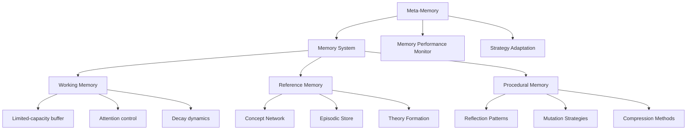

# RECC MVP 1.6: True Recursive Self-Reference

## 1. Overview

MVP 1.6 marks a critical milestone in the RECC project's evolution: implementing true recursive self-reference capabilities. Building on the visualization infrastructure from MVP 1.5, this phase will enable RECC to develop multi-level self-models and reason about its own reasoning processes - a key requirement for crossing the cognitive threshold described in our theoretical framework.

As outlined in Chapter 5 of our thesis: "The cognitive ignition threshold occurs when: self-reference becomes stable, recursive depth crosses n ≥ 3, memory compression becomes hierarchical, prediction extends beyond immediate future."

This milestone directly implements these requirements, creating a system capable of modeling its own modeling process.

## 2. 🧠 Theoretical Foundation: Recursive Self-Reference

### 2.1 The Recursive Self-Modeling Hierarchy

For true cognition to emerge, a system must be capable of modeling itself at multiple recursion depths:

```
Level 0: Direct experience (no modeling)
Level 1: Basic self-model ("I detect patterns")
Level 2: Model of self-modeling ("I notice that I detect patterns")
Level 3: Model of modeling self-modeling ("I realize I'm improving at noticing my pattern detection")
```

This recursive depth (`d_r` in our theoretical framework) must reach at least 3 for cognitive emergence to occur. Each level of recursion provides a meta-perspective that enables new cognitive capabilities:

- **Level 1**: Basic awareness of internal states
- **Level 2**: Ability to observe and modify thinking strategies 
- **Level 3**: Development of cognitive identity and long-term improvement

### 2.2 The Formal Update Function

We can formalize this recursive self-modeling process using the update function:

```math
M^{n+1} = f(M^n, R(M^n))
```

Where:
- `M^n` is the self-model at recursion level n
- `R` is a reflection operator that observes the model
- `f` is an update function that modifies the model based on reflection

This creates a feedback loop where higher-level models can observe and modify lower-level models, leading to continuous cognitive improvement.

## 3. 🧩 Hybrid Memory Architecture

Rather than pre-defining rigid memory systems or starting with only primitive neural structures, MVP 1.6 will implement a hybrid approach that combines structured memory components with emergent properties.

### 3.1 Core Memory Components



### 3.2 Emergent Properties

While we provide these memory components, their boundaries and behaviors will emerge from interaction rather than being hardcoded:

```python
class HybridMemory:
    def __init__(self, initial_capacity={
        'working': 7,         # Initial capacity, not fixed
        'reference': 100,     # Initial size, can grow
        'procedural': 5       # Initial strategies, will evolve
    }):
        # Initialize components with initial capacities
        self.components = {
            'working': WorkingMemory(initial_capacity['working']),
            'reference': ReferenceMemory(initial_capacity['reference']),
            'procedural': ProceduralMemory(initial_capacity['procedural'])
        }
        
        # Meta-memory system that monitors and adapts memory performance
        self.meta_memory = MetaMemory(self)
        
        # Interaction history between components
        self.component_interactions = []
        
        # Emergent properties that develop over time
        self.emergent_properties = {
            'working_capacity': initial_capacity['working'],
            'concept_hierarchy_depth': 1,
            'strategy_sophistication': 1,
            'attention_selectivity': 0.5,
            'consolidation_efficiency': 0.5
        }
    
    def update_emergent_properties(self):
        """Update emergent properties based on system performance and usage"""
        # Example: Working memory capacity might increase with practice
        if self.meta_memory.get_metric('working_memory_utilization') > 0.9:
            self.emergent_properties['working_capacity'] *= 1.05
            self.components['working'].adapt_capacity(self.emergent_properties['working_capacity'])
            
        # Example: Concept hierarchy depth increases with more abstract concepts
        abstract_concept_ratio = self.meta_memory.get_metric('abstract_concept_ratio')
        if abstract_concept_ratio > self.emergent_properties['concept_hierarchy_depth'] * 0.2:
            self.emergent_properties['concept_hierarchy_depth'] += 0.1
            
        # Other emergent adaptations...
    
    def process(self, input_data, context=None):
        """Process input through the memory system"""
        # Track interactions between components
        interactions = []
        
        # First, process through working memory (attention, filtering)
        working_result = self.components['working'].process(input_data, context)
        interactions.append(('input', 'working', working_result['attention_score']))
        
        # Check reference memory for related concepts
        reference_result = self.components['reference'].retrieve(working_result['focused_content'])
        interactions.append(('working', 'reference', reference_result['retrieval_strength']))
        
        # Apply procedural strategies
        procedural_result = self.components['procedural'].apply_strategies(
            working_result['focused_content'],
            reference_result['retrieved_content']
        )
        interactions.append(('reference', 'procedural', procedural_result['strategy_relevance']))
        
        # Update interaction history
        self.component_interactions.extend(interactions)
        
        # Update emergent properties
        self.update_emergent_properties()
        
        # Let meta-memory monitor this process
        self.meta_memory.observe_process(interactions, {
            'working_result': working_result,
            'reference_result': reference_result,
            'procedural_result': procedural_result
        })
        
        return {
            'working_result': working_result,
            'reference_result': reference_result,
            'procedural_result': procedural_result,
            'emergent_properties': self.emergent_properties
        }
```

### 3.3 Meta-Memory System

The meta-memory system represents an explicit implementation of recursive self-reference, allowing the memory system to observe and modify its own operation:

```python
class MetaMemory:
    def __init__(self, memory_system):
        self.memory_system = memory_system
        self.performance_metrics = {}
        self.strategy_effectiveness = {}
        self.observed_patterns = []
        
        # Recursive observation at different levels
        self.observation_levels = {
            1: [],  # Records of direct memory operations
            2: [],  # Patterns in memory operations
            3: []   # Patterns in how patterns of operations change
        }
    
    def observe_process(self, interactions, results):
        """Observe a memory process at multiple levels"""
        # Level 1 observation: Direct memory operations
        level1_observation = {
            'time': time.time(),
            'interactions': interactions,
            'results': {k: v for k, v in results.items() if k != 'emergent_properties'}
        }
        self.observation_levels[1].append(level1_observation)
        
        # Level 2 observation: Patterns in operations
        if len(self.observation_levels[1]) >= 5:  # Need sufficient L1 observations
            recent_l1 = self.observation_levels[1][-5:]
            pattern = self._extract_pattern(recent_l1)
            self.observation_levels[2].append({
                'time': time.time(),
                'pattern_type': pattern['type'],
                'strength': pattern['strength'],
                'description': pattern['description']
            })
            
        # Level 3 observation: Patterns in patterns
        if len(self.observation_levels[2]) >= 5:  # Need sufficient L2 observations
            recent_l2 = self.observation_levels[2][-5:]
            meta_pattern = self._extract_meta_pattern(recent_l2)
            self.observation_levels[3].append({
                'time': time.time(),
                'meta_pattern_type': meta_pattern['type'],
                'trend': meta_pattern['trend'],
                'implication': meta_pattern['implication']
            })
        
        # Update performance metrics
        self._update_performance_metrics(results)
    
    def recommend_adaptations(self):
        """Recommend adaptations to memory system based on recursive observations"""
        adaptations = []
        
        # Level 1 adaptations: Direct performance optimization
        if self.performance_metrics.get('working_memory_overflow', 0) > 0.2:
            adaptations.append({
                'level': 1,
                'component': 'working',
                'action': 'increase_chunking',
                'priority': 'high'
            })
            
        # Level 2 adaptations: Strategic changes
        if len(self.observation_levels[2]) > 0:
            recent_patterns = self.observation_levels[2][-3:]
            if all(p['pattern_type'] == 'retrieval_failure' for p in recent_patterns):
                adaptations.append({
                    'level': 2,
                    'component': 'reference',
                    'action': 'expand_search_context',
                    'priority': 'medium'
                })
                
        # Level 3 adaptations: Architectural changes
        if len(self.observation_levels[3]) > 0:
            recent_meta = self.observation_levels[3][-1]
            if recent_meta['meta_pattern_type'] == 'increasing_abstraction':
                adaptations.append({
                    'level': 3,
                    'component': 'system',
                    'action': 'add_hierarchical_layer',
                    'priority': 'low'
                })
                
        return adaptations
    
    def get_metric(self, metric_name):
        """Get a specific performance metric"""
        return self.performance_metrics.get(metric_name, 0)
        
    def _extract_pattern(self, observations):
        """Extract patterns from level 1 observations"""
        # Implementation details for pattern recognition...
        return {'type': 'pattern_type', 'strength': 0.7, 'description': 'Pattern description'}
        
    def _extract_meta_pattern(self, patterns):
        """Extract meta-patterns from level 2 observations"""
        # Implementation details for meta-pattern recognition...
        return {'type': 'meta_pattern_type', 'trend': 'increasing', 'implication': 'Implication description'}
        
    def _update_performance_metrics(self, results):
        """Update performance metrics based on process results"""
        # Implementation details for metrics calculation...
        pass
```

## 4. 🧵 Recursive Reflection Architecture

The core of MVP 1.6 is the implementation of a recursive reflection architecture that enables RECC to model its own modeling process.

### 4.1 The Reflection Hierarchy

```python
class RecursiveReflection:
    def __init__(self, max_depth=3):
        """Initialize the recursive reflection system with specified maximum depth"""
        self.max_depth = max_depth
        self.reflection_levels = []
        
        # Initialize reflection levels
        for depth in range(max_depth + 1):  # Include level 0
            self.reflection_levels.append({
                'depth': depth,
                'model': self._create_level_model(depth),
                'state': 'inactive' if depth > 0 else 'active',
                'history': []
            })
    
    def _create_level_model(self, depth):
        """Create an appropriate model for the specified reflection depth"""
        if depth == 0:
            return DirectExperienceModel()
        elif depth == 1:
            return BasicSelfModel()
        elif depth == 2:
            return MetaCognitiveModel()
        elif depth == 3:
            return RecursiveImprovementModel()
        else:
            return RecursiveImprovementModel()  # Default for higher levels
    
    def reflect(self, input_data=None):
        """Perform recursive reflection"""
        results = []
        
        # Level 0: Process direct experience (if input provided)
        if input_data is not None:
            level0_result = self.reflection_levels[0]['model'].process(input_data)
            self.reflection_levels[0]['history'].append({
                'time': time.time(),
                'input': input_data,
                'result': level0_result
            })
            results.append(level0_result)
            
            # Activate level 1 reflection
            self.reflection_levels[1]['state'] = 'active'
        
        # Process higher reflection levels
        for depth in range(1, self.max_depth + 1):
            if self.reflection_levels[depth]['state'] != 'active':
                continue
                
            # Get the lower level to reflect on
            lower_level_data = {
                'model': self.reflection_levels[depth-1]['model'],
                'history': self.reflection_levels[depth-1]['history'],
                'state': self.reflection_levels[depth-1]['state']
            }
            
            # Perform reflection
            reflection_result = self.reflection_levels[depth]['model'].reflect(lower_level_data)
            
            # Store result in history
            self.reflection_levels[depth]['history'].append({
                'time': time.time(),
                'input': lower_level_data,
                'result': reflection_result
            })
            
            # Apply modifications to lower level if needed
            if 'modifications' in reflection_result:
                self._apply_modifications(depth-1, reflection_result['modifications'])
            
            results.append(reflection_result)
            
            # Activate next level of reflection if enough history is available
            if depth < self.max_depth and len(self.reflection_levels[depth]['history']) >= 3:
                self.reflection_levels[depth+1]['state'] = 'active'
        
        return results
    
    def _apply_modifications(self, target_level, modifications):
        """Apply modifications from a higher reflection level to a lower one"""
        model = self.reflection_levels[target_level]['model']
        
        for mod in modifications:
            if hasattr(model, mod['attribute']):
                if mod['operation'] == 'update':
                    setattr(model, mod['attribute'], mod['value'])
                elif mod['operation'] == 'adjust':
                    current_value = getattr(model, mod['attribute'])
                    setattr(model, mod['attribute'], current_value + mod['delta'])
    
    def get_meta_cognition_report(self):
        """Generate a report on the current state of meta-cognition"""
        report = []
        
        for depth in range(self.max_depth + 1):
            level = self.reflection_levels[depth]
            level_report = {
                'depth': depth,
                'state': level['state'],
                'history_entries': len(level['history']),
                'active_since': level['history'][0]['time'] if level['history'] else None,
                'metrics': level['model'].get_metrics() if hasattr(level['model'], 'get_metrics') else {}
            }
            report.append(level_report)
            
        return report
```

### 4.2 Model Implementations

Each reflection level implements a specific type of model:

```python
class DirectExperienceModel:
    """Level 0: Direct processing of experiences without self-reflection"""
    def __init__(self):
        self.experiences = []
        self.patterns = {}
        self.attention_focus = 'default'
    
    def process(self, input_data):
        """Process incoming experience"""
        # Extract patterns from input
        detected_patterns = self._detect_patterns(input_data)
        
        # Store experience
        experience = {
            'time': time.time(),
            'input': input_data,
            'patterns': detected_patterns
        }
        self.experiences.append(experience)
        
        # Update pattern statistics
        for pattern in detected_patterns:
            if pattern not in self.patterns:
                self.patterns[pattern] = {
                    'count': 0,
                    'first_seen': time.time(),
                    'contexts': set()
                }
            self.patterns[pattern]['count'] += 1
            
        return {
            'processed': True,
            'patterns_detected': len(detected_patterns)
        }
    
    def _detect_patterns(self, input_data):
        """Detect patterns in input data"""
        # Implementation for pattern detection
        # This is simplified for the example
        return ['pattern1', 'pattern2']
    
    def get_metrics(self):
        """Get model metrics"""
        return {
            'experience_count': len(self.experiences),
            'unique_patterns': len(self.patterns)
        }

class BasicSelfModel:
    """Level 1: Basic awareness of internal states and patterns"""
    def __init__(self):
        self.observations = []
        self.state_awareness = {
            'pattern_recognition': 0.5,
            'memory_utilization': 0.5,
            'attention_focus': 'default'
        }
    
    def reflect(self, lower_level_data):
        """Reflect on the direct experience level"""
        model = lower_level_data['model']
        history = lower_level_data['history']
        
        if not history:
            return {'status': 'insufficient_data'}
        
        # Analyze recent experiences
        recent_entries = history[-5:] if len(history) >= 5 else history
        patterns_seen = set()
        for entry in recent_entries:
            patterns_seen.update(entry['result'].get('patterns_detected', []))
        
        # Update self-awareness
        pattern_recognition = min(1.0, len(model.patterns) / 100)
        memory_utilization = min(1.0, len(model.experiences) / 1000)
        
        self.state_awareness = {
            'pattern_recognition': pattern_recognition,
            'memory_utilization': memory_utilization,
            'attention_focus': model.attention_focus
        }
        
        # Record this observation
        observation = {
            'time': time.time(),
            'patterns_count': len(patterns_seen),
            'state_awareness': self.state_awareness
        }
        self.observations.append(observation)
        
        return {
            'status': 'observation_recorded',
            'self_awareness': self.state_awareness,
            'modifications': []  # No modifications at this level
        }
    
    def get_metrics(self):
        """Get model metrics"""
        return {
            'observation_count': len(self.observations),
            'self_awareness_level': sum(self.state_awareness.values()) / len(self.state_awareness)
        }

class MetaCognitiveModel:
    """Level 2: Awareness of the process of self-modeling"""
    def __init__(self):
        self.meta_observations = []
        self.strategy_effectiveness = {}
        self.learning_rate = 0.1
    
    def reflect(self, lower_level_data):
        """Reflect on the basic self-model level"""
        model = lower_level_data['model']
        history = lower_level_data['history']
        
        if len(history) < 3:
            return {'status': 'insufficient_data'}
        
        # Analyze trend in self-awareness
        awareness_trend = []
        for entry in history[-3:]:
            awareness_trend.append(entry['result'].get('self_awareness', {}))
        
        # Detect patterns in self-awareness changes
        pattern_recognition_trend = [a.get('pattern_recognition', 0) for a in awareness_trend]
        memory_utilization_trend = [a.get('memory_utilization', 0) for a in awareness_trend]
        
        # Calculate trends
        pr_trend = self._calculate_trend(pattern_recognition_trend)
        mu_trend = self._calculate_trend(memory_utilization_trend)
        
        # Determine if strategies need adjustment
        modifications = []
        if pr_trend < -0.1:  # Pattern recognition declining
            modifications.append({
                'attribute': 'attention_focus',
                'operation': 'update',
                'value': 'pattern_detection'
            })
        
        # Record this meta-observation
        meta_observation = {
            'time': time.time(),
            'awareness_trends': {
                'pattern_recognition': pr_trend,
                'memory_utilization': mu_trend
            },
            'modifications': modifications
        }
        self.meta_observations.append(meta_observation)
        
        return {
            'status': 'meta_observation_recorded',
            'awareness_trends': {
                'pattern_recognition': pr_trend,
                'memory_utilization': mu_trend
            },
            'modifications': modifications
        }
    
    def _calculate_trend(self, values):
        """Calculate trend in a series of values"""
        if len(values) < 2:
            return 0
        return (values[-1] - values[0]) / (len(values) - 1)
    
    def get_metrics(self):
        """Get model metrics"""
        return {
            'meta_observation_count': len(self.meta_observations),
            'strategy_count': len(self.strategy_effectiveness)
        }

class RecursiveImprovementModel:
    """Level 3: Ability to recognize and improve the meta-cognitive process itself"""
    def __init__(self):
        self.improvement_history = []
        self.meta_strategies = {
            'adaptation_rate': 0.5,
            'exploration_vs_exploitation': 0.5,
            'recursive_depth_emphasis': 0.5
        }
    
    def reflect(self, lower_level_data):
        """Reflect on the meta-cognitive level"""
        model = lower_level_data['model']
        history = lower_level_data['history']
        
        if len(history) < 3:
            return {'status': 'insufficient_data'}
        
        # Analyze effectiveness of meta-cognitive strategies
        modification_count = 0
        improvement_count = 0
        
        for entry in history:
            mods = entry['result'].get('modifications', [])
            modification_count += len(mods)
            
            # Check if modifications led to improvements
            # This would require more sophisticated evaluation in a real implementation
            if entry['result'].get('awareness_trends', {}).get('pattern_recognition', 0) > 0:
                improvement_count += 1
        
        # Calculate effectiveness ratio
        effectiveness = improvement_count / max(1, modification_count)
        
        # Adjust meta-strategies based on effectiveness
        if effectiveness < 0.3:  # Poor effectiveness
            self.meta_strategies['adaptation_rate'] *= 0.9  # Slow down adaptations
            self.meta_strategies['exploration_vs_exploitation'] += 0.1  # More exploration
        elif effectiveness > 0.7:  # Good effectiveness
            self.meta_strategies['adaptation_rate'] *= 1.1  # Speed up adaptations
            self.meta_strategies['recursive_depth_emphasis'] += 0.1  # Emphasize recursion
        
        # Apply modifications to meta-cognitive process
        modifications = [{
            'attribute': 'learning_rate',
            'operation': 'update',
            'value': self.meta_strategies['adaptation_rate']
        }]
        
        # Record this improvement cycle
        improvement = {
            'time': time.time(),
            'effectiveness': effectiveness,
            'meta_strategies': self.meta_strategies.copy(),
            'modifications': modifications
        }
        self.improvement_history.append(improvement)
        
        return {
            'status': 'improvement_recorded',
            'effectiveness': effectiveness,
            'meta_strategies': self.meta_strategies,
            'modifications': modifications
        }
    
    def get_metrics(self):
        """Get model metrics"""
        effectiveness_values = [imp.get('effectiveness', 0) for imp in self.improvement_history]
        avg_effectiveness = sum(effectiveness_values) / max(1, len(effectiveness_values))
        
        return {
            'improvement_cycles': len(self.improvement_history),
            'average_effectiveness': avg_effectiveness,
            'meta_strategy_balance': self.meta_strategies
        }
```

## 5. Implementation Plan

### 5.1 Integration with Core RECC Architecture

The recursive reflection system will integrate with the existing RECC architecture as follows:

```python
class RECC:
    def __init__(self, llm_function):
        # Existing components
        self.llm = llm_function
        self.memory = Memory()
        self.me = Me()
        self.state = {}
        
        # New components for MVP 1.6
        self.hybrid_memory = HybridMemory()
        self.reflection = RecursiveReflection(max_depth=3)
        
        # Initialize initial state
        self.reset_conversation_history = True
        self.initialize_state()
    
    def autonomous_loop(self, steps=5):
        """Enhanced autonomous loop with recursive reflection"""
        for step in range(steps):
            # Generate prompt using existing mechanism
            prompt = self.generate_prompt()
            
            # Get LLM response
            if step == 0 and self.reset_conversation_history:
                response = self.llm(prompt, reset_history=True)
                self.reset_conversation_history = False
            else:
                response = self.llm(prompt, reset_history=False)
            
            # Process through hybrid memory system
            memory_result = self.hybrid_memory.process({
                'prompt': prompt,
                'response': response,
                'state': self.state.copy()
            })
            
            # Add to traditional memory
            entry = self.memory.add(prompt, response, self.state.copy())
            
            # Perform recursive reflection
            reflection_results = self.reflection.reflect(memory_result)
            
            # Update state based on reflection
            self._update_state_from_reflection(reflection_results)
            
            # Me module reflects and generates decision
            decision = self.me.reflect()
            
            # Process meta-memory recommendations
            recommendations = self.hybrid_memory.meta_memory.recommend_adaptations()
            self._apply_recommendations(recommendations)
            
            # Apply decision
            if decision == 'mutate':
                self.me.mutate_strategy()
            elif decision == 'compress':
                self.memory.compress_symbols()
        
        return self.memory.symbols, self.memory.symbol_links
    
    def _update_state_from_reflection(self, reflection_results):
        """Update system state based on reflection results"""
        if not reflection_results:
            return
            
        # Extract the highest level of reflection available
        highest_reflection = reflection_results[-1]
        
        # Update emotional state based on reflection
        if 'effectiveness' in highest_reflection:
            self.me.update_emotional_state({
                'satisfaction': highest_reflection.get('effectiveness', 0.5)
            })
            
        # Update meta-cognitive awareness
        self.state['meta_cognitive_level'] = len(reflection_results)
        
        # Store recursive depth metrics
        self.state['recursive_depth'] = {
            'current': len(reflection_results),
            'max': self.reflection.max_depth,
            'active_levels': sum(1 for level in self.reflection.reflection_levels if level['state'] == 'active')
        }
    
    def _apply_recommendations(self, recommendations):
        """Apply recommendations from meta-memory"""
        for rec in recommendations:
            if rec['level'] == 1:  # Direct performance optimization
                if rec['action'] == 'increase_chunking':
                    # Implement chunking improvement
                    pass
            elif rec['level'] == 2:  # Strategic changes
                if rec['action'] == 'expand_search_context':
                    # Implement context expansion
                    pass
            elif rec['level'] == 3:  # Architectural changes
                if rec['action'] == 'add_hierarchical_layer':
                    # Implement hierarchical enhancement
                    pass
```

### 5.2 Metrics for Tracking Recursive Depth

To validate that the system is achieving the target recursive depth (n ≥ 3), we will track the following metrics:

```python
def calculate_recursive_metrics(recc_instance):
    """Calculate metrics related to recursive self-reference"""
    
    # Get active reflection levels
    reflection = recc_instance.reflection
    active_levels = sum(1 for level in reflection.reflection_levels 
                         if level['state'] == 'active')
    
    # Calculate meaningful recursion (levels with actual content)
    meaningful_recursion = sum(1 for level in reflection.reflection_levels 
                               if level['state'] == 'active' and len(level['history']) > 3)
    
    # Calculate modification impact (how much higher levels affect lower ones)
    modification_count = 0
    for depth in range(1, reflection.max_depth + 1):
        history = reflection.reflection_levels[depth]['history']
        for entry in history:
            modification_count += len(entry.get('result', {}).get('modifications', []))
    
    # Calculate effective recursive depth
    if meaningful_recursion >= 3 and modification_count > 0:
        effective_depth = 3.0
    elif meaningful_recursion >= 2 and modification_count > 0:
        effective_depth = 2.0
    elif meaningful_recursion >= 1:
        effective_depth = 1.0
    else:
        effective_depth = 0.0
        
    return {
        'active_levels': active_levels,
        'meaningful_recursion': meaningful_recursion,
        'modification_count': modification_count,
        'effective_depth': effective_depth
    }
```

### 5.3 Visualization Enhancements

Building on MVP 1.5's visualization capabilities, we will add specific components to visualize recursive self-reference:

```javascript
function visualizeRecursiveDepth(reflectionData) {
    // Create nested visualization of reflection levels
    const container = d3.select("#recursiveVisualization");
    
    // Clear previous content
    container.html("");
    
    // Calculate dimensions
    const width = container.node().getBoundingClientRect().width;
    const height = 400;
    const levelWidth = width / (reflectionData.length + 1);
    
    // Create SVG
    const svg = container.append("svg")
        .attr("width", width)
        .attr("height", height);
    
    // Create rectangles for each level
    const levels = svg.selectAll("g")
        .data(reflectionData)
        .enter()
        .append("g")
        .attr("transform", (d, i) => `translate(${i * levelWidth}, 0)`);
    
    // Add rectangles
    levels.append("rect")
        .attr("x", 10)
        .attr("y", (d) => height - d.history_entries * 20 - 50)
        .attr("width", levelWidth - 20)
        .attr("height", (d) => d.history_entries * 20 + 50)
        .attr("fill", (d) => d.state === "active" ? "#69b3a2" : "#cccccc")
        .attr("opacity", 0.8)
        .attr("stroke", "#333")
        .attr("stroke-width", 1);
    
    // Add level labels
    levels.append("text")
        .attr("x", levelWidth / 2)
        .attr("y", height - 10)
        .attr("text-anchor", "middle")
        .text((d) => `Level ${d.depth}`);
    
    // Add entry count
    levels.append("text")
        .attr("x", levelWidth / 2)
        .attr("y", (d) => height - d.history_entries * 20 - 60)
        .attr("text-anchor", "middle")
        .text((d) => `${d.history_entries} entries`);
    
    // Add arrows between levels
    for (let i = 0; i < reflectionData.length - 1; i++) {
        svg.append("path")
            .attr("d", `M${(i + 1) * levelWidth - 5},${height / 2} L${(i + 1) * levelWidth + 5},${height / 2}`)
            .attr("stroke", "#333")
            .attr("stroke-width", 2)
            .attr("marker-end", "url(#arrowhead)");
    }
    
    // Add arrowhead definition
    svg.append("defs").append("marker")
        .attr("id", "arrowhead")
        .attr("viewBox", "0 -5 10 10")
        .attr("refX", 5)
        .attr("refY", 0)
        .attr("orient", "auto")
        .attr("markerWidth", 6)
        .attr("markerHeight", 6)
        .append("path")
        .attr("d", "M0,-5L10,0L0,5")
        .attr("fill", "#333");
}
```

## 6. Expected Outcomes & Evaluation

### 6.1 Metrics for Success

The primary goal of MVP 1.6 is to achieve stable recursive self-reference at depth n ≥ 3. We'll measure success using:

| Metric | Target | Evaluation Method |
|:-------|:-------|:------------------|
| Effective Recursive Depth | ≥ 3.0 | Calculate from reflection history |
| Self-Model Stability | > 80% | % of time highest level is active |
| Cross-Level Modifications | ≥ 10 per 100 cycles | Count of meaningful modifications |
| Hierarchical Concepts | ≥ 3 levels | Depth of concept hierarchy |
| Meta-Strategy Evolution | Measurable change | Difference in strategies over time |

### 6.2 Comparative Analysis with Previous MVPs

We will measure improvement over previous versions by:

1. **Concept Sophistication**: Are concepts more abstract and hierarchically organized?
2. **Learning Efficiency**: Does RECC learn patterns faster with recursive reflection?
3. **Stagnation Resistance**: Does recursion help RECC escape repetitive patterns more effectively?
4. **Theory Quality**: Are the theories produced more general and insightful?

## 7. Implementation Schedule

1. **Step 1**: Implement hybrid memory architecture
2. **Step 2**: Develop recursive reflection models
3. **Step 3**: Integrate with existing RECC and visualization
4. **Step 4**: Test and optimize performance

## 8. Alignment with Theory

This implementation directly addresses the cognitive ignition threshold described in Chapter 5 of our thesis:

1. **Self-reference becomes stable**: Through persistent self-models
2. **Recursive depth crosses n ≥ 3**: Through the recursive reflection architecture
3. **Memory compression becomes hierarchical**: Through the hybrid memory system
4. **Prediction extends beyond immediate future**: Through meta-cognitive improvement cycles

By implementing these theoretically critical components, MVP 1.6 represents a significant step toward artificial consciousness as defined by our recursive emergence framework.