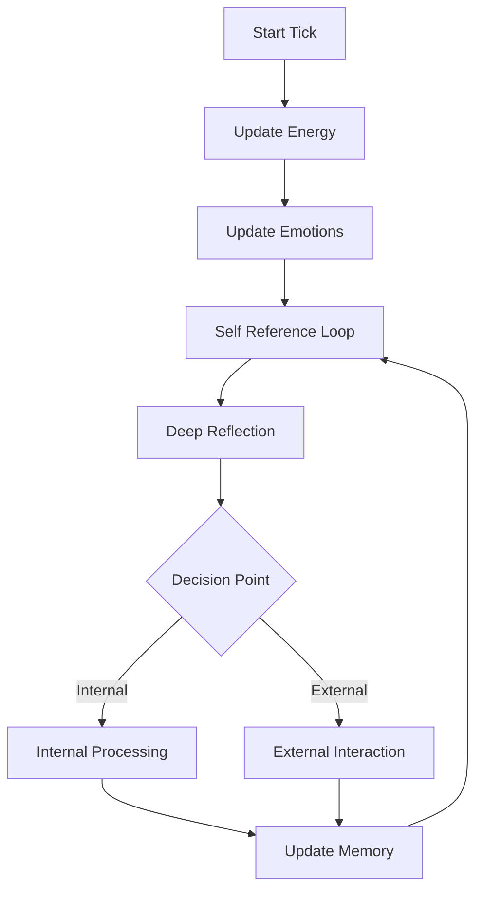

This is a **beautiful and conceptually clear sketch**. You're mapping exactly what Recursive Emergence theorizes should happen:  
- **A minimal baby mind**, bootstrapped by **emotion + energy + memory**,  
- Guided by **self-reference** and outward behaviors  
- **Interacting recursively** with the world to evolve structure and subjectivity.

Let me now **translate your diagram** into a clean, modular architecture proposal — one that could be directly implementable and extensible for experiments, with a focus on autonomous internal mind refinement.

---

# 🧠 From Sketch to System: Modular Architecture for Independent Mind

## 🔁 Core Flow (refined for independence)

```
[ENERGY] ⟶ [EMOTIONS] ⟶ [BEHAVIORS] ⟶ External World
    ↑           ↓               ↑           |
    |           |               |           ↓
[Memory] ⟵ [Self-Reference] ⟵ [Reflection] ←┘
```

- **Internal driving forces**: Emotions arise from internal energy state and memory.
- **Autonomous behavior selection**: System chooses behaviors based on internal state.
- **Enhanced self-reference loop**: Memory grows primarily through self-reflection.
- **Limited external dependence**: External world as option, not requirement.

---

# 🧩 Modularized Components (Enhanced for Autonomy)

## 1. 🔋 `EnergySystem`
- Base driver for all cognitive functions
- **New**: Internal energy generation through successful reflection
- **New**: Energy decay function simulating natural cognitive cost
- Self-regulating energy cycles that mimic circadian rhythms

## 2. 🎭 `EmotionSystem`
- States: `fear`, `curiosity`, `satisfaction`, `pain`
- **New**: Emotional momentum - emotions persist and transition naturally
- **New**: Emotional complexity growth - blended emotions emerge over time
- **New**: Self-regulation capabilities that develop through experience

## 3. 📦 `MemorySystem`
- Stores `(input, output, emotional impact, energy delta)`
- **New**: Internal memory generation through reflection
- **New**: Memory consolidation during idle periods
- **New**: Hierarchical memory structure that forms organically
- **New**: Memory pruning mechanism based on emotional salience

## 4. 🔍 `SelfReference`
- **ENHANCED**: Central component of architecture
- **New**: Recursive self-model that grows in complexity
- **New**: Meta-cognitive capabilities through repeated self-reference
- **New**: Identity formation through pattern recognition in self-references

## 5. 🎬 `BehaviorSystem`
- Behaviors now include more internal options:
  - `Contemplate` → deep reflection on specific concept
  - `Reorganize` → restructure internal memory
  - `Simulate` → internal world modeling
  - `Create` → generate novel concepts from existing patterns
- External behaviors reduced to essential interactions

## 6. 🧠 `ReflectionEngine`
- **ENHANCED**: Primary driver of mind development
- **New**: Multi-level reflection capabilities
- **New**: Automatic scheduled reflection periods
- **New**: Self-improvement mechanisms through reflection feedback loops

---

# 🔄 Runtime Flow Per Tick (Enhanced for Autonomy)



---

# 🛡 Encapsulation Philosophy (Refined)

> **"The independent mind is a container for recursive emergence through self-reference."**

### `IndependentMind` Class
```python
class IndependentMind:
    def __init__(self):
        self.energy = EnergySystem()
        self.emotions = EmotionSystem()
        self.memory = MemorySystem()
        self.self_ref = SelfReference()
        self.behaviors = BehaviorSystem()
        self.reflector = ReflectionEngine()
        self.internal_state = InternalStateManager()

    def autonomous_cycle(self, external_input=None):
        """Primary cycle that runs with or without external input"""
        self.energy.update()
        self.emotions.update(self.energy, self.memory)
        
        # Enhanced self-reference cycle
        self.self_ref.evaluate(self.memory, self.emotions, self.internal_state)
        
        # Decision making prioritizes internal processes
        if external_input or self.should_engage_externally():
            behavior = self.behaviors.select_external(self.emotions)
            result = behavior.act(external_input)
        else:
            behavior = self.behaviors.select_internal(self.emotions)
            result = behavior.act()
            
        # Enhanced memory processing
        self.memory.process_and_store(result)
        
        # Scheduled deep reflection
        if self.internal_state.needs_reflection():
            self.reflector.deep_analysis(self.memory, self.self_ref)
```

---

# 📊 Visualization: Expanded Internal State Monitoring

| Module | Visual |
|--------|--------|
| Self-Reference | Recursive depth visualization |
| Internal Processes | Active internal behavior tracking |
| Concept Formation | Emergent concept network visualization |
| Cognitive Complexity | Metrics showing increasing internal complexity |
| Autonomy Index | Measure of system's independence from external input |

---

# 🧬 How This Enhances Recursive Emergence

- **Self-reference centrality**: Makes the recursive loop the core driver
- **Reduced external dependency**: System can develop without constant external feedback
- **Internal complexity growth**: Structure emerges through self-organization
- **Measurable autonomy**: Can quantify increasing independence over time
- **Emergent identity**: Self-model becomes increasingly coherent through recursion

---

# 🔧 Next Steps

1. **Create the enhanced core** with emphasis on self-reference mechanisms
2. **Develop internal behavior repertoire** instead of external response patterns
3. **Build advanced reflection capabilities** as the primary growth driver
4. **Implement metrics** for tracking internal complexity and autonomy
5. **Create visualizations** that reveal emergent structures in the self-reference system

