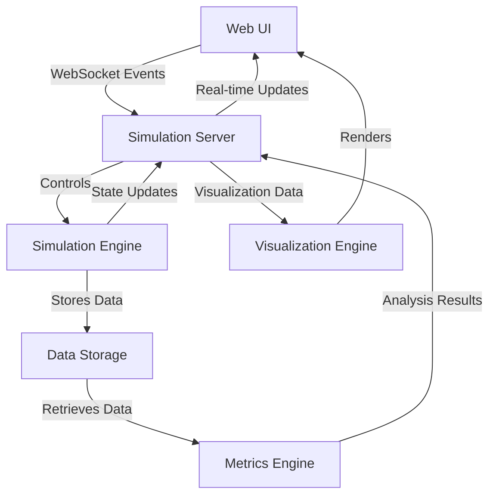

# RECC Architecture

We will define a reusable architecture for the RE theorem as a general simulation framework to demo the experiments and outcomes. The architecture uses a web UI as an observable interface to show the ongoing simulation, while the backend consists of a simulation engine that runs the simulation and provides results to the web UI. A rich data storage layer keeps the simulation data and metrics for observing key performance indicators.

## Architecture Overview

## Component Details

### Web UI
- Real-time interactive dashboard for visualizing simulation progress
- Controls for starting, stopping, and configuring simulations
- Multiple visualization types (graphs, networks, state diagrams)
- Threshold event notifications

### Simulation Server
- Flask + SocketIO for bidirectional communication
- Handles client connections and simulation lifecycle
- Manages simulation threading and resource allocation
- Routes metrics and visualization data to the UI

### Simulation Engine
- Core computational engine implementing the RE algorithms
- Manages simulation state and progression
- Implements physical/chemical/logical rules of the model
- Emits events on significant state changes

### Data Storage
- Structured storage for simulation states and history
- Support for save/load functionality
- Enables analysis across multiple simulation runs
- Configurable persistence options (memory, file, database)

### Metrics Engine
- Real-time calculation of system metrics
- Detection of emergence thresholds
- Statistical analysis of simulation outcomes
- Hypothesis testing capabilities

### Visualization Engine
- Renders complex data structures into interactive visualizations
- Network graphs for entity relationships
- Time series charts for metrics
- State transition diagrams

## Communication Flow
1. User initiates actions via Web UI
2. Simulation Server receives commands via WebSocket
3. Simulation Engine processes commands and updates state
4. Metrics Engine analyzes ongoing simulation data
5. Visualization Engine transforms results into visual representations
6. Web UI receives updates and renders them for the user

## Implementation Technologies
- **Frontend**: HTML5, CSS3, JavaScript (with D3.js for visualizations)
- **Communication**: WebSockets via Socket.IO
- **Backend Server**: Flask/Python
- **Simulation Engine**: Python with NumPy/SciPy
- **Data Storage**: JSON files and in-memory structures (expandable to databases)