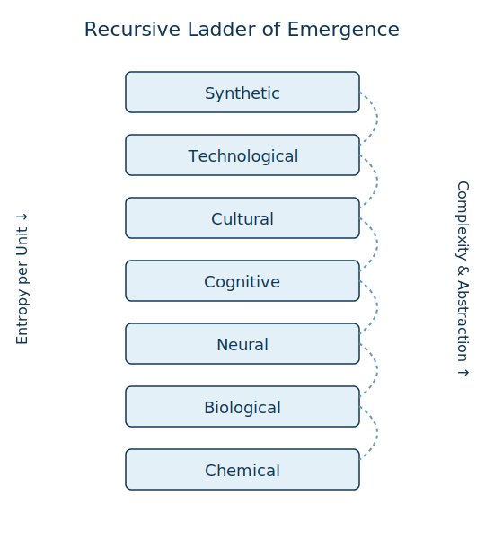
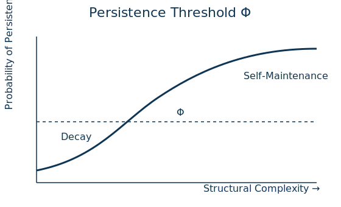
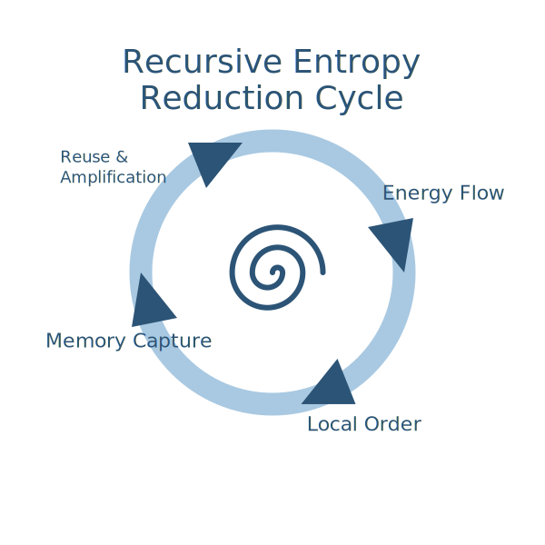
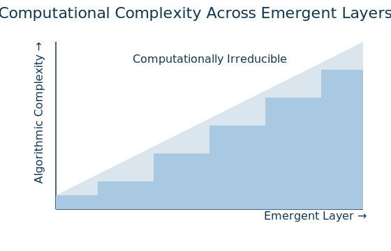

# Recursive Emergence — Comprehensive Synthesis  
*Draft — 18 Apr 2025*

---

## 1 · Context & Motivation
Over this dialogue we explored how **recursive entropy‑reduction + memory reuse** explains the climb from pre‑biotic chemistry to synthetic minds. Key outcomes:

* Formalised the framework with `P(E)=R(E)·ΔH`, a persistence threshold `Φ`, and a memory accumulator `Mₜ`.
* Linked it to negentropy (Schrödinger), autocatalytic RAF sets, Hebbian plasticity, predictive processing, IIT, and computational irreducibility.
* Produced four diagrams that distil the argument visually.
* Framed why *instant, feedback‑driven learning* outruns the linear passes used by today’s large language models.

---

## 2 · Thesis in One Sentence
> **Recursive Law of Emergence** – Whenever an interaction spawns a structure that is simultaneously *re‑usable* **and** *entropy‑reducing*, that structure feeds back into the next round of interactions. Iterated indefinitely, the process builds stacked layers of lower‑entropy, higher‑complexity organisation. Because each layer rewrites the search space, no single linear pass can compress the full trajectory (echoing `P ≠ NP`).

---

## 3 · Why Linear Filters Fall Short

| Brain‑like Recursive Loop | Transformer‑style Linear Pass |
| --- | --- |
| Online weight **writes** every event | Mostly weight **reads**; topology frozen |
| Predict → Act → Sense → Predict (closed loop) | Encode prompt → Decode answer (one‑shot) |
| Generates fresh training data by acting | Consumes static i.i.d. data |
| Loss landscape co‑evolves with learner | Landscape fixed at compile time |

A genuine Artificial Conscious Intelligence therefore needs architectures that *update themselves online* and can rewrite their own loss surface—precisely the property of recursive emergence.

---

## 4 · Figures (inline SVG)

> **Tip:** The following figures are linked from the images directory for better rendering quality and performance.

### 4.1 Recursive Ladder of Emergence

### 4.2 Persistence Threshold Φ

### 4.3 Recursive Entropy Reduction Cycle

### 4.4 Computational Complexity Across Layers

---

## 5 · Next Steps  
1. **Empirical anchors** — plug each layer into concrete datasets (e.g. RAF chemistry simulations, spiking‑network predictors).  
2. **Φ as ΔW** — refine persistence threshold to include write‑volume per time.  
3. **Prototype ACI** — build a sandbox agent with on‑line weight adaptation and explicit memory graph to test the theory.

*End of draft.*
